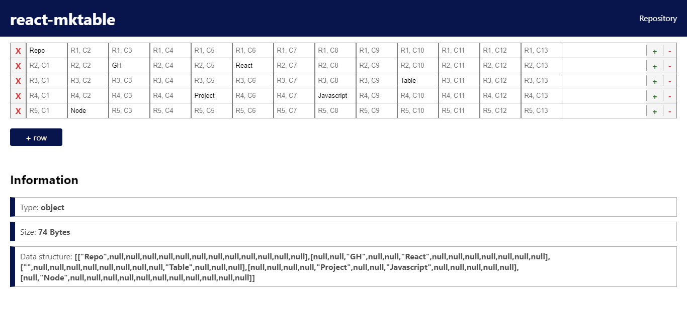

# react-mktable
<p> </p>
<p>Create a dynamic table for React.</p>
<p>That's a simple React project to demonstrate the structure of the javascript object.</p>

## Example
<p><p/>

## Usage
### As user
The app is published at https://vilmacio22.github.io/react-mktable/
### As developer
```bash
# Clone this repository
$ git clone https://github.com/vilmacio22/react-mktable.git

# Go into the repository
$ cd react-mktable

# Install dependencies
$ yarn install

# Run development server
$ yarn start
```

## License
This project is under the MIT license. See the [LICENSE](https://github.com/vilmacio22/react-mktable/blob/master/LICENSE) for more information.

---

Created by [vilmacio22](https://github.com/vilmacio22)
